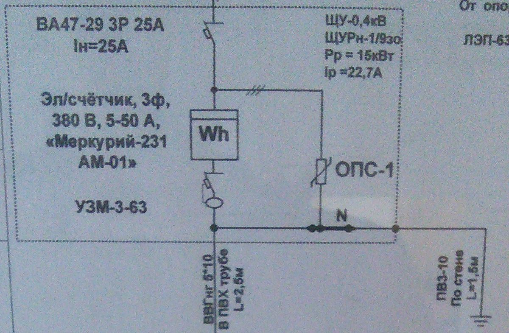
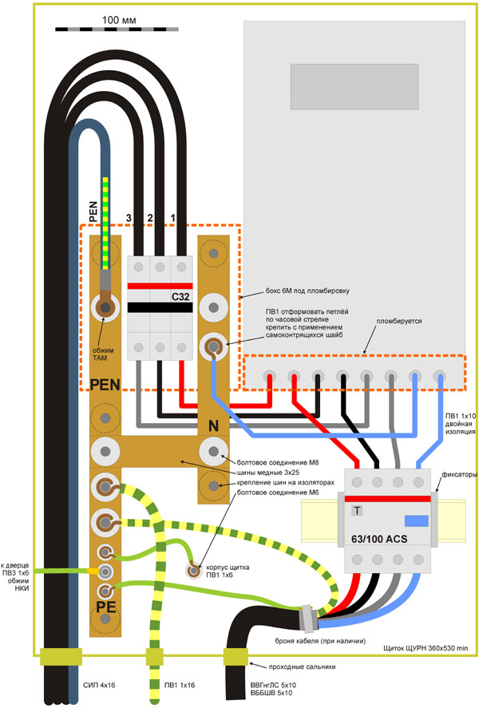

Подключение электричества
-------------------------

Итак, для начала вам надо подать заявку на техническое присоединение. Для этого можно приехать по 
адресу г. Кстово, ул Магистральная, 2а (время работы понедельник, вторник, четверг с 8:00 до 17:00) 
https://maps.yandex.ru/-/CVsNbVkG или подать заявку через интернет:

 * Зарегистрироваться по адресу: https://utp.mrsk-cp.ru/_layouts/15/MRSKGetData/Registration.aspx
 * Зайти в личный кабинет: https://utp.mrsk-cp.ru/_layouts/15/MRSKGetData/PersonalOffice.aspx
 * Перейти на форму подачи заявки https://utp.mrsk-cp.ru/_layouts/15/MRSKGetData/UserRequestTP.aspx?communicationChannel=PersonalOffice     

В заявке нужно указать подключение до 15 кВт (три фазы), а в качестве "Наименование энергопринимающих устройств" нужно
указать "Хозяйственная постройка". 

**Если укажите дом, то вас не подключат, пока не будут готовы стены первого этажа.**

Также для заявки вам понадобится **копия паспорта**, **копия документа, подтверждающего право собственности**, 
а также **план местности** (достаточно картинки из гугл/яндекс карт с вашим участком и несколькими дорогами)

После подачи заявления, вам предстоит подождать 10 дней (МРСК как и остальные гос структуры, делают всё в последний разрешенный законом день) и дождаться звонка из МРСК, где вам предложат приехать на магистральную 2а, чтобы ознакомится с тех условиями.

**Не  подписываете техусловия не глядя. Внимательно прочтите. Каждый пункт который там написан, нужно будет вам выполнить! Если вам какой то пункт не нравится, можно будет написать мот отказ, на который вам в течении пары недель придёт  обоснованный ответ, в котором вам откажут поменять техусловия. Если вы считаете что отказ не обоснован (в 99% случаях это будет именно так), то можно дальше время на письма не тратить, а идти сразу в ФАС. Практика показывает, что в течении пары месяцев, Техусловия становятся в соответствии с Правилами недискриминационного доступа к услугам по передаче электрической энергии и оказания этих услуг (Постановление Правительства РФ от 27.12.2004 N 861)**

Подробности можно найти на форумхаусе:  [Кстовские электрические сети. Подключение пустого ЗУ в Нижегородской области, вопросы и обсуждение](http://www.consultant.ru/document/cons_doc_LAW_51030/)

Небольшая выжимка из темы:  [Кстовские электрические сети - подключение ЗУ, отчёты](https://www.forumhouse.ru/threads/316106/)

Благодаря участникам, не пожалевшие свое время, МРСК стали выдавать более / менее вменяемые Тех Условия.

После подписания ТехУсловий, ждете еще пару недель, когда МРСК подпишет договор на техническое присоединение.

После этого  собираете щиток сами (или обращаетесь к профессионалам), приобретаете кабель СИП 4 четырех жильный, арматуру для подключения, устанавливаете заземление, покупаете фиктивный паспорт на заземление (1500 р) и звоните местному электрику (Сергей +7 903 восемьсот сорок семь 50 95)

Обратите внимание, что ВРУ / Щит учета вы не сможете повесить на столбы МРСК. Поэтому, если столб находится на вашей стороне дороге, то кабель кидается напрямик к вашему объекту электроснабжения. В случае, когда столб находится на другой стороне дороги, вам придётся перекидывать кабеля через дорогу так, чтобы провис был не меньше 5-6 метров. Для этого не обязательно ставить бетонный столб за 20 тысяч (5 тысяч стоит сам столб и 15 тысяч его установка). Достаточно установить любой деревянный брус или металлическую трубу, так чтобы крепление троса было на высоте 4-5 метров.  

Арматура СИП
------------

Здесть приведены ссылки на магазин электрон. Но вы купить в любом магазине электротоваров тоже самое или аналоги:
* Кабель: [Провод СИП-4 4x16](http://el.ru/catalogue/cable/8/18)  (провод лучше брать с запасом. Запас можно будет скрутить в кольцо и использовать его в случае переноса счетчика)
* Два зажима анкерных: [ЗАБ 16-25](http://el.ru/catalogue/cable-systems/45/306)
* Четыре зажима ответвительных: Зажим ответвительный [ЗОИ 16-95/2.5-35](http://el.ru/catalogue/cable-systems/45/311)

ВРУ и Щит Учета
---------------

Предлагаемая схема узла учета (висит на входе в отдел где выдают ТУ в МРСК).

То есть ВРУ / ЩИТ учета должен включать 
* вводной автомат на три фазы с током отключения 25А и характеристикой C. Например, [Автоматический выключатель Acti9 iK60N 3P 25А характеристика C](http://el.ru/catalogue/protection-devices/52/349)
* Электрический счетчик на три фазы с максимальным током не менее 50А. Можно взять любой самый дешевый. У нас популярна модель Меркурий 231, но я рекомендую взять [Энергомера CE301-R33](http://www.energomera.ru/ru/products/meters/ce301r33), так как он дешевле конкурента от Меркурия и значительно меньше в размерах.
* Ограничитель импульсных перенапряжений: Ограничитель импульсных перенапряжений [IEK ОПС1-C 3Р 20кА](http://el.ru/catalogue/protection-devices/43/302). Подойдет любой аналог, в том числе можно взять не один трехфазный, три однофазных ограничителя.
* Реле контроля напряжения. Можно либо взять три [УЗМ-51М](http://el.ru/catalogue/control-systems/25/196) или один [УЗМ-3-63](http://meandr.ru/uzm63). Первый вариант удобнее в эксплуатации, так при возникновения перенапряжения в одной фазе, отключится только эта фаза. Второй вариант -- дешевле в два раза, но при перенапряжении в одной из фаз, отключится сразу все фазы.
* Сам щит. Примеры щитов от IEK: http://www.iek.ru/products/catalog/detail.php?ID=9261 

К сожалению, отдел учета в Кстовских сетях, большие параноики, а про ПУЭ они не слышали. Поэтому приходится делать щит не по правилам, например вот так:

 (картинка взята c forumhouse.ru )

А напрямик вводить PEN провод (желто зеленый) в счетчик. Соответственно схема будет вот такой: TODO

Кроме перечисленных выше потребуются также следующая мелочь:
Провода, ПВ1 или ПВ3 (если есть клещи для обжима наконечников для многожильных медных проводов и сами наконечники). Провод должен быть сечением минимум на 6 мм2. Крайне рекомендуется взять провод разных цветов: синий 2 метра) -- нулевой,  зелено/желтый (3 метра), и на каждую по два метра (обычно фазные провода имею цвет красный, желтый, зеленый, но могут быть и другие, такие как черный, белый, коричневый и т.д.)
Медная шина заземления минимум на 8 контактов. 
Дополнительные DIN рейки и крепеж для них. Число, длина и т.д. зависит от выбранного щита, а также планируемого расположения элементов в нём.
Стяжки для стягивания проводов, чтобы Щит выглядел красивее
Гофра диаметром 32 под провод СИП. 
Рекомендую потратиться на клеммы: Клеммный зажим IEK ЗНИ 6 мм². Необходимо три серых, один синий и один зелено желтый. Это позволит сделать аккуратное подключение выходного кабеля.
Также советую купить ограничители для DIN рейки, чтобы автоматы по рейкам не скользили: http://el.ru/catalogue/switchboards/26/178
